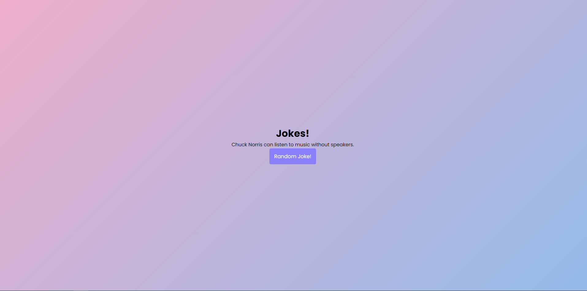
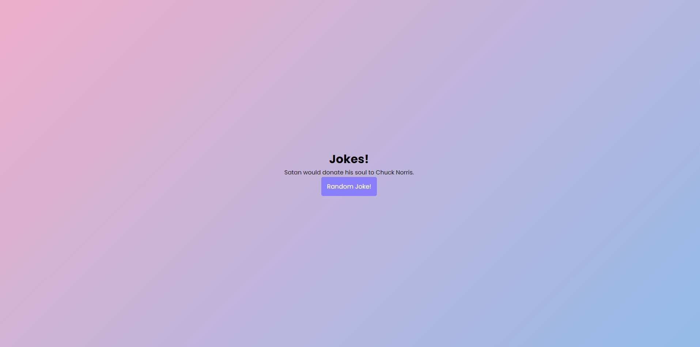

<h1 align="center"> Chuck Norris API Jokes  </h1>

## About

A Spring application that prints Chuck Norris jokes downloaded from the API.

## Screenshots

## Resources

- [Chuck Norris API](https://api.chucknorris.io/jokes/random). Data source. 